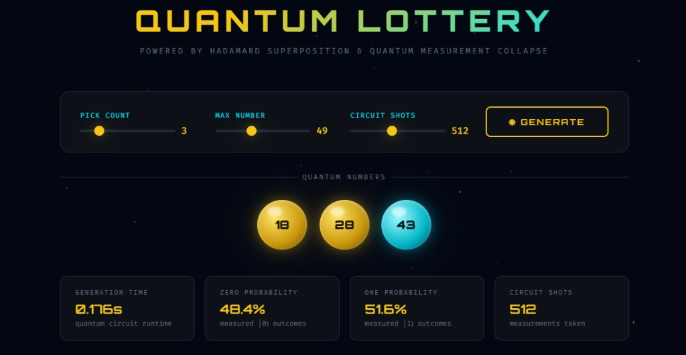
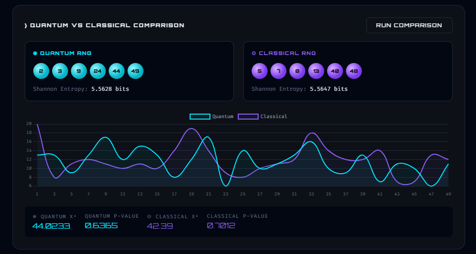
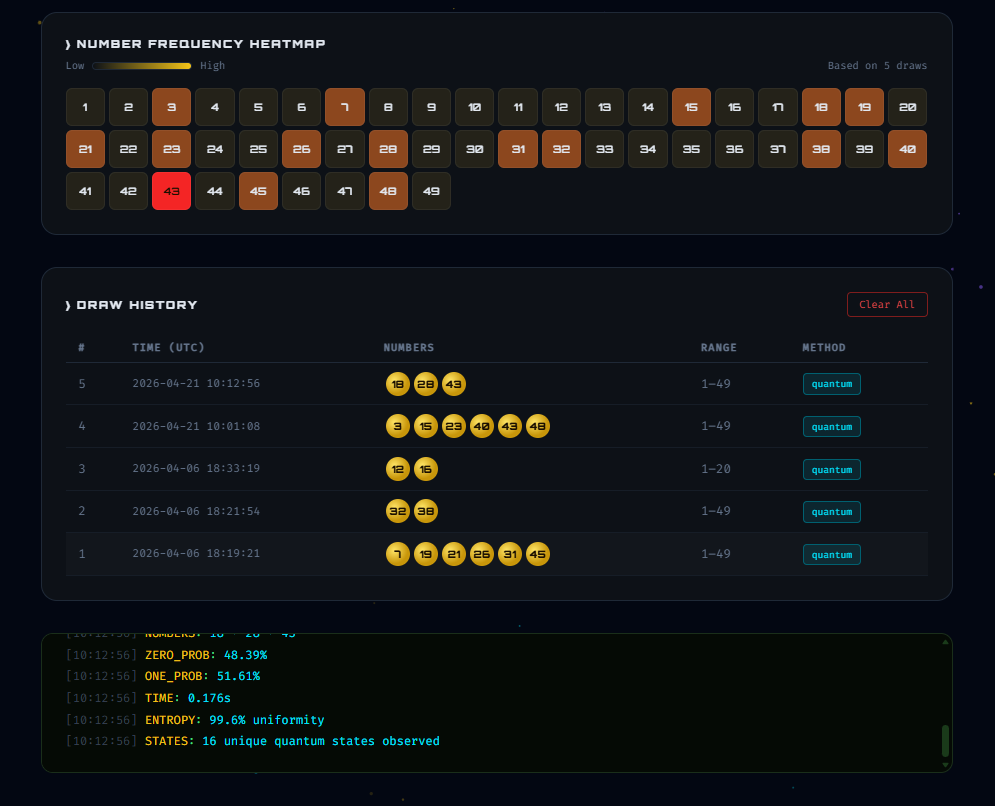

# Quantum Lottery Picker

Quantum Lottery Picker is a web project that simulates quantum randomness to generate lottery numbers and visualize how random outcomes behave over repeated measurements.

## What This Project Does

- Generates lottery numbers using a quantum circuit workflow (Hadamard superposition + measurement collapse).
- Lets users control draw settings like number count, max range, and circuit shots.
- Visualizes probability outcomes (`|0>` and `|1>`), quantum state frequencies, and entropy score.
- Demonstrates Bell-state entanglement output.
- Compares quantum RNG vs classical RNG using entropy and chi-square analysis.
- Stores past draws and shows a frequency heatmap from history.
- Lets users analyze their own lucky numbers using simulation.

## Tools and Libraries Used

### Backend

- `Python` - core language
- `Flask` - API server and routing
- `Flask-CORS` - cross-origin support for frontend calls
- `Qiskit` - quantum circuit creation and measurement logic
- `qiskit-aer` - `qasm_simulator` backend for circuit execution
- `sqlite3` - local draw history storage
- `math`, `time`, `random`, `datetime` - utility/stat operations

### Data/Visualization Helpers

- `matplotlib` + `pylatexenc` - optional quantum circuit image rendering
- `scipy` - optional chi-square statistical test for RNG comparison

### Frontend

- `HTML5` + `CSS3` - UI structure and styling
- `Vanilla JavaScript` - user interactions and API integration
- `Chart.js` - probability, state distribution, timeline, and comparison charts

## Project Structure

- `app.py` - Flask backend + quantum logic + API routes
- `index.html` - complete frontend UI
- `lottery_history.db` - SQLite database for draw history
- `requirements.txt` - Python dependencies

## Run Locally

1. Install dependencies:

```bash
pip install -r requirements.txt
```

2. Start the app:

```bash
python app.py
```

3. Open in browser:

```text
http://localhost:5000
```

## Screenshots

### Main Interface



### Quantum vs Classical Comparison



### Heatmap and Draw History



